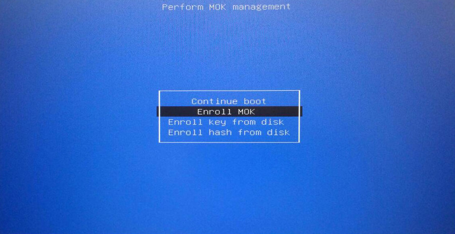

# VirtualBox en KUbuntu

Después de instalar KUbuntu 24.04 utilizando Balena Etcher con ISO y que quedó el boot de manera correcta, me encontré con que no funcionó la instalación de controladores de VirtualBox una vez instalado.

Esto debido a que el boot UEFI, priorizando un Inicio Seguro, requiere que se firmen controladores antes de poder cargarlos en memoria.

## Situación

Usualmente la instalación de los controladores de VirtualBox es transparente, pero en esta ocasión, no se pudieron cargar y me pedía que utilizara:

```bash
modprobe vboxdrv
```

Sin embargo, esto me daba el error:

```bash
modprobe: ERROR: could not insert 'vboxdrv': Required key not available
```

Buscando el error, encontré que el problema es que cuando se utiliza el boot UEFI, la parte de seguridad busca que los controladores del kernel estén firmados.

## Solución

Seguí estas instrucciones para resolverlo:

Primero entré como root usando sudo:

```bash
sudo su -
```

Luego creé un directorio dónde poner los archivos de cifrado que se van a enviar a la nvram.

```bash
mkdir vboxsign
cd vboxsign
```

Se van a requerir los paquetes mokutil y openssl, en caso de que no estén instalados se puede hacer con:

```bash
apt install mokutil openssl
```

Entonces procedemos a crear los archivos para firma (donde dice Tu Nombre, se pone el nombre de la persona u organización para la firma del certificado):

```bash
openssl req -new -x509 -newkey rsa:2048 -keyout MOK.key -out MOK.crt -nodes -days 3650 -subj "/CN=Tu Nombre/"
openssl x509 -in MOK.crt -out MOK.cer -outform DER
```

Esto creará los archivos siguientes:

```bash
ll
total 24
drwxr-xr-x  2 root root 4096 may 28 19:33 ./
drwx------ 11 root root 4096 may 28 19:33 ../
-rw-r--r--  1 root root  803 may 28 03:13 MOK.cer
-rw-r--r--  1 root root 1143 may 28 03:12 MOK.crt
-rw-------  1 root root 1704 may 28 03:12 MOK.key
```

Una vez creados, utilizaremos mokutil para subir el certificado a la nvram para el inicio seguro, esto pedirá una contraseña, es importante guardarla ya que en el siguiente reinicio, pedirá esta contraseña:

```bash
mokutil -i MOK.cer
```

Entonces reiniciaremos la máquina.

Una vez reiniciada entrará a un menú similar a este:



Una vez en el menú, se selecciona `Enroll MOK > Continue > Yes` y ahí es donde va a pedir la contraseña.

Ya que avise que la operación fue exitosa, iniciará de forma normal la máquina.

Para continuar se requieren los archivos fuente del kernel, y aprovecharemos para actualizar o instalar unas herramientas:

```bash
apt install --reinstall linux-headers-$(uname -r) virtualbox-dkms dkms
```

En mi caso, los archivos estaban comprimidos con zstd y los encontré en la ruta `/lib/modules/6.8.0-31-generic/updates/dkms/`:

```bash
ll /lib/modules/6.8.0-31-generic/updates/dkms/
total 2280
drwxr-xr-x 2 root root    4096 may 28 13:10 ./
drwxr-xr-x 3 root root    4096 may 28 02:43 ../
-rw-r--r-- 1 root root  328022 may 28 13:02 vboxdrv.ko.zst
-rw-r--r-- 1 root root   35455 may 28 13:02 vboxnetadp.ko.zst
-rw-r--r-- 1 root root   61098 may 28 13:02 vboxnetflt.ko.zst
```

Por lo que tuve que descomprimirlos, firmarlos y volverlos a comprimir:

### Descomprimir

```bash
zstd -d vboxdrv.ko.zst -o vboxdrv.ko
zstd -d vboxnetadp.ko.zst -o vboxnetadp.ko
zstd -d vboxnetflt.ko.zst -o vboxnetflt.ko
```

### Firmar

Entonces procederemos a buscar la utilería `sign-file`, con la que firmaremos los archivos:

```bash
find /usr/src -iname sign-file
/usr/src/linux-headers-6.8.0-31-generic/scripts/sign-file
```

Y entonces firmamos los archivos con:

```bash
/usr/src/linux-headers-6.8.0-31-generic/scripts/sign-file sha256 ~/vboxsign/MOK.key ~/vboxsign/MOK.cer vboxdrv.ko
/usr/src/linux-headers-6.8.0-31-generic/scripts/sign-file sha256 ~/vboxsign/MOK.key ~/vboxsign/MOK.cer vboxnetadp.ko
/usr/src/linux-headers-6.8.0-31-generic/scripts/sign-file sha256 ~/vboxsign/MOK.key ~/vboxsign/MOK.cer vboxnetflt.ko
```

### Comprimir

```bash
zstd vboxdrv.ko -o vboxdrv.ko.zst
zstd vboxnetadp.ko -o vboxnetadp.ko.zst
zstd vboxnetflt.ko -o vboxnetflt.ko.zst
```

### Últimos pasos

Ya hecho esto, podemos cargar los módulos manualmente con `modprobe` o reiniciar la máquina y probar.

```bash
modprobe vboxdrv
modprobe vboxnetadp
modprobe vboxnetflt
```

## Shell
Para automatizar, creé un pequeño shell script que ejecuto cada vez que hay una nueva versión ya sea de kernel o de Virtual Box, da por sentado que ya se realizó la creación de los certificados y fueron agregados a la nvram, y se encuentran en la carpeta `/home/root/vboxsign` (ejecutar con el usuario root):

```bash
apt install --reinstall linux-headers-$(uname -r) virtualbox-dkms dkms
cd /lib/modules/$(uname -r)/updates/dkms
for vbfile in $(ls /lib/modules/$(uname -r)/updates/dkms)
do
        uncompressed_name=${vbfile%.*}
        module_name=${uncompressed_name%.*}
        zstd -d $vbfile -o $uncompressed_name
        /usr/src/linux-headers-$(uname -r)/scripts/sign-file sha256 ~/vboxsign/MOK.key ~/vboxsign/MOK.cer $uncompressed_name
        mv $vbfile $vbfile.bak
        zstd $uncompressed_name -o $vbfile
        modprobe $module_name
done

```

## Nota final

Al parecer estos pasos funcionan tanto para todas las versiones de ubuntu, así como para debian.

Me encontré con otro problema.

Tenía el error: No se pueden mostrar los dispositivos USB.

Esto es porque mi usuario por defecto no se había agregado al grupo vboxusers, así que sólo procedí a añadirlo.

El comando groups nos muestra a que grupos pertenecemos:

```bash
groups
```

Una vez que hemos confirmado que no pertenecemos al grupo de vboxusers, lo agregamos con `gpasswd`:

```bash
sudo gpasswd -a $USER vboxusers
```
